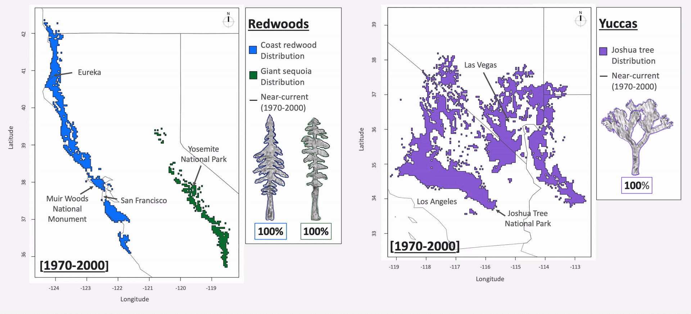
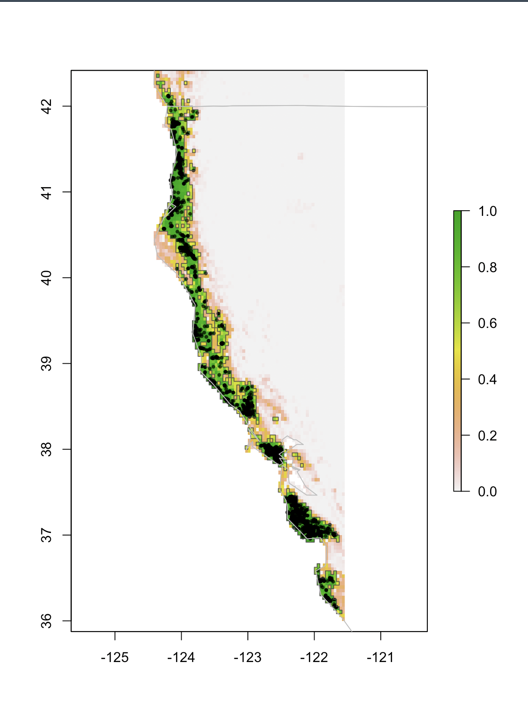
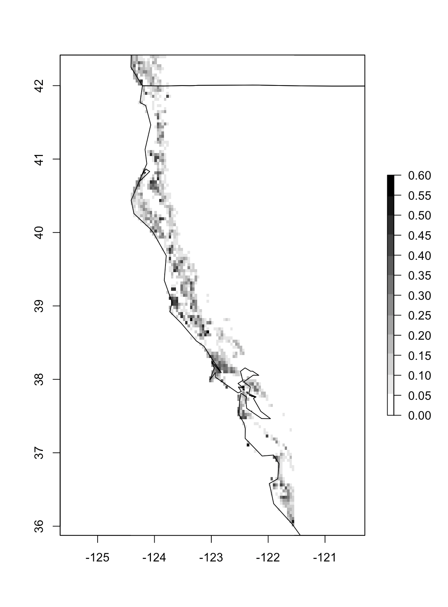
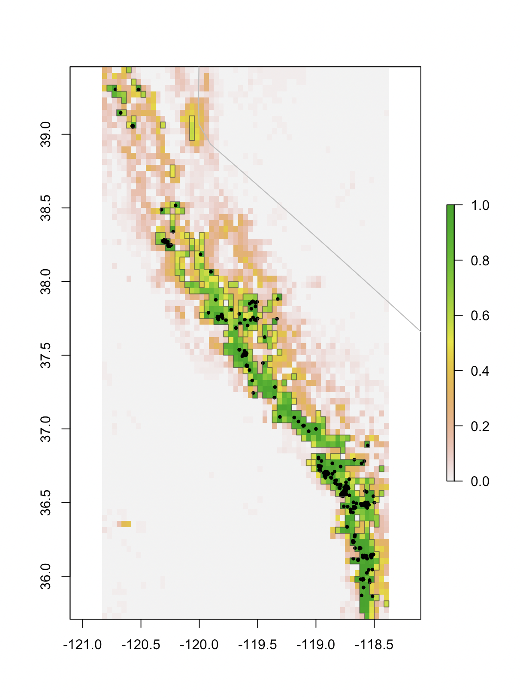
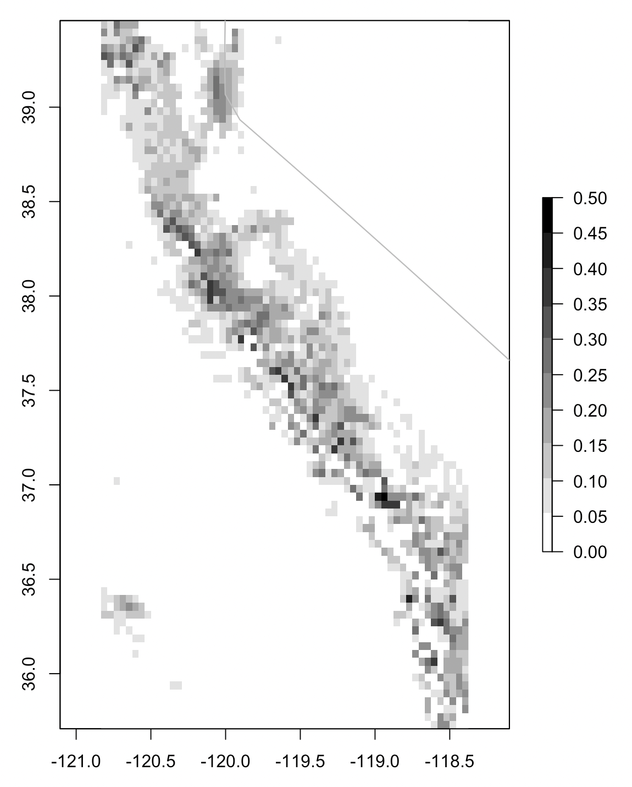
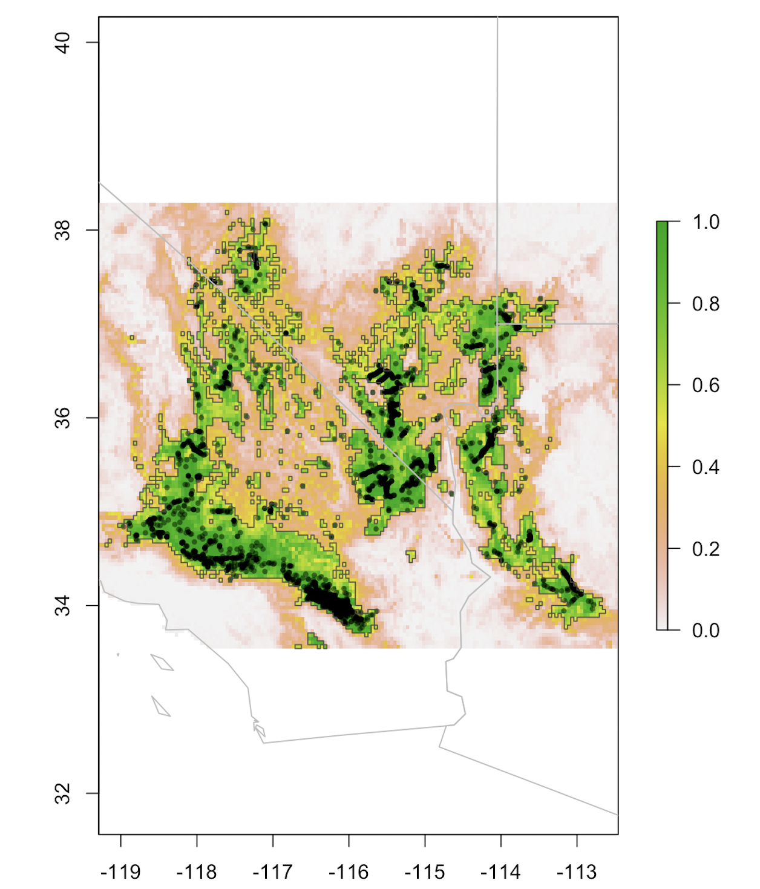
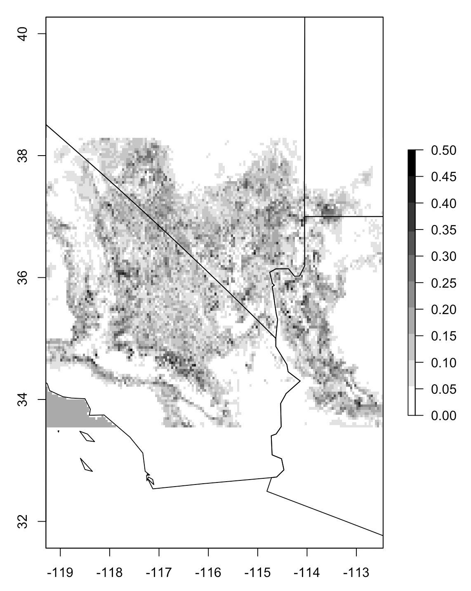

# Species Distribution Models in Python
---
See the **<a target="_blank" rel="noopener noreferrer" href="https://daniel-furman.github.io/Python-species-distribution-modeling/">*tutorial link*</a>**.

---

A short tutorial for spatial classification in Python through an example in species distribution modeling. Read on for more advanced applications of SDM modeling in ecological research, which, at heart, use the same basics as covered in the tutorial. 


## Examples of SDMs research outputs using Python

### Example 1: "EcoRisk Forecasts - California" for DAT/Artathon 2021





<br>

### Descriptive Stats for Climatic Change between 1985 to 2070 at Species Presences:

Bioclimatic Variable  | Coast redwood % Change | Giant sequoia % Change | Joshua tree % Change
-----|-------|-------|-------
Temperature Annual Mean | +22% | +47% | +24%
Temperature Annual Range | +5% | +4% | +2%
Precipitation Driest Month | -1% | -2% | -7%

* SSP 370 [CMIP6](https://www.worldclim.org/data/cmip6/cmip6climate.html) models for the IPCC6 report.
* Bioclimatic Features from [WorldClim2](https://www.worldclim.org/data/worldclim21.html)
* Species presences from GBIF and carefully cleaned

<br>

### Example 2: Probablistic near-current interpolation

* Blending methods boosted model performances to ~ two-zero false negatives per species.

**Coast redwood** SDM geo-classification (*Sequoia sempervirens*) | Standard deviations from multiple seeds/samples. 
:---------------------------------:|:----------------------------------------:
 | 

**Giant sequioa** SDM geo-classification (*Sequoiadendron giganteum*) | Standard deviations from multiple seeds/samples.
:---------------------------------:|:----------------------------------------:
 | 

**Joshua tree** SDM geo-classification (*Yucca brevifolia*) | Standard deviations from multiple seeds/samples. 
:---------------------------------:|:----------------------------------------:
 | 


### Requirements

---

Python dependencies are listed in a `requirements-py.txt` file, including the library version numbers. You can replicate the environment your codebase needs by using virtualenv:

```
# This creates the virtual environment
cd $PROJECT-PATH
virtualenv ensemble-climate-projections
```
Then install the dependencies by referring to the requirements-py.txt:
```
# This installs the modules
pip install -r requirements-py.txt

# This activates the virtual environment
source ensemble-climate-projections/bin/activate
```
